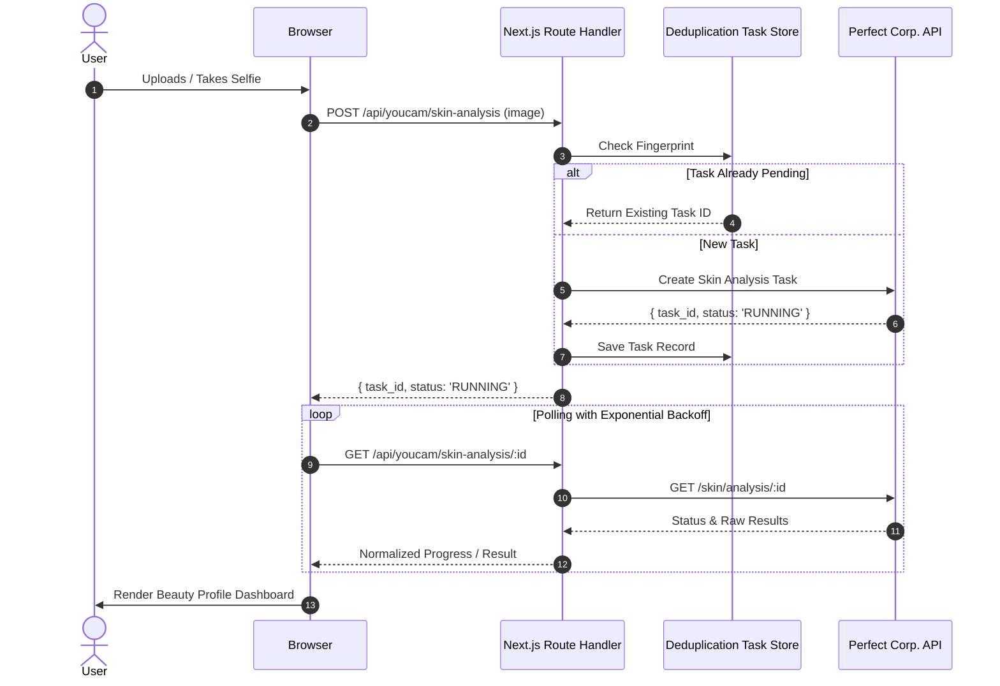

# GlowFit AI Architecture & Integration Specification

## 1. System Overview
GlowFit AI is a modern full-stack web application built on Next.js 14 (App Router) that merges computer vision, personalized intent calibration, and virtual try-on into a unified beauty commerce decision engine.

---

## 2. Layered Architecture

### A. Presentation & Interaction Layer
- **Framework:** Next.js 14 App Router with React Server Components and Client Components where interactivity is required.
- **Styling System:** Vanilla Tailwind CSS configured with a bespoke luxury beauty palette (`glow-charcoal`, `glow-ivory`, `glow-rose`, `glow-champagne`).
- **Micro-Interactions:** Smooth drag-to-compare sliders, zoom controls, and scanning animations built with Framer Motion and responsive touch handlers.
- **State Management:** `GlowFitContext` orchestrates the complete shopping loop across routes while providing offline-resilient local persistence for guest visitors.

### B. AI Engine Layer (`/lib/youcam/`)
All third-party AI communications are executed strictly on the server:
- `config.ts`: Environment validation, runtime security assertion, and `DEMO_MODE` detection.
- `types.ts`: Strict typed interfaces for both raw Perfect Corp. API payloads and normalized GlowFit domain models.
- `client.ts`: Standardized HTTP client handling multipart binary uploads, presigned storage transfers, task creation, and polling.
- `tasks.ts`: Deduplication engine using request fingerprinting to prevent redundant task creation if a user refreshes or taps repeatedly.
- `normalize.ts`: Data adapter mapping raw optical responses into clean internal models without hallucinating missing fields.
- `errors.ts`: Typed error hierarchy mapping HTTP 400, 401, 422, 429, and 504 codes into user-friendly guidance.

### C. Recommendation & Smart Budget Engine (`/lib/recommendations.ts`)
Multi-factor scoring algorithm calculating product suitability:
$$\text{Score} = \text{Base} + S_{\text{style}} + S_{\text{occasion}} + S_{\text{undertone}} + S_{\text{skin-type}} + S_{\text{rating}}$$

1. **Occasion Matching:** Calibrates formulation longevity and light-bounce based on selected event (e.g. Wedding Guest vs Everyday).
2. **Undertone Synergy:** Matches Warm, Cool, Neutral, or Olive pigments to prevent ashy shift.
3. **Smart Budget Tiering:** Automatically fits 4 core cosmetic categories (Base, Lips, Cheeks, Eyes) within the user's selected INR budget (₹500, ₹1,000, ₹1,500, ₹3,000, or Custom).
4. **Transparent Rationale:** Generates explicit "Why GlowFit Chose This" and "Why This Product" reasons for every recommendation.

### D. Persistence & Security Layer (`/supabase/`)
- PostgreSQL schema with tables: `profiles`, `products`, `looks`, `skin_analyses`, `beauty_preferences`, `saved_looks`, and `api_tasks`.
- Comprehensive Row Level Security (RLS) policies guaranteeing user isolation.
- Fallback local session state for instant hackathon exploration without mandatory login friction.

---

## 3. Asynchronous AI Task Flow

---

## 4. Anti-Hallucination & Anti-Fake Compliance
- **No Hallucinated Fields:** If an optical metric is not returned by the YouCam API, it is omitted rather than fabricated.
- **Explicit Demo Labeling:** In Demo Mode, all headers, cards, and try-on visuals display prominent **DEMO MODE / Sample AI Result / DEMO VIRTUAL TRY-ON** indicators.
- **No Silent Fallback:** In Live Mode, API failures surface clear, actionable error dialogues with retry buttons.
